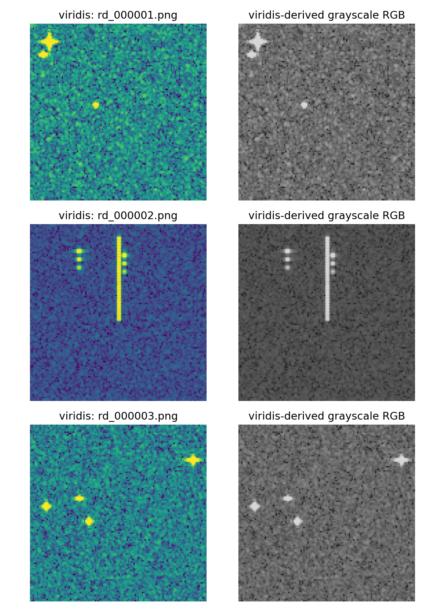
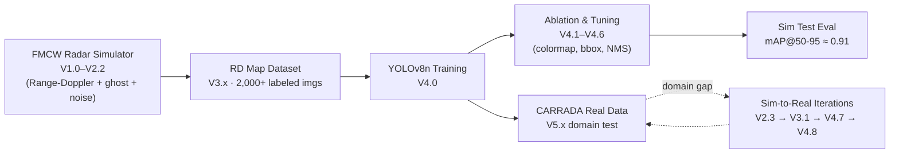
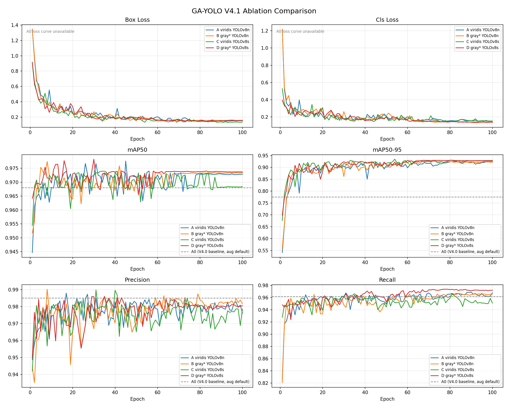

<div align="center">

# GA-YOLO — Ghost-Aware YOLO for FMCW Automotive Radar
### FMCW 자동차 레이더 Range-Doppler Map에서 Real / Ghost 표적을 직접 분류하는 경량 탐지기

<br/>


<br/>

**시뮬레이션으로 학습 데이터를 직접 생성하고, RD map 단계에서 multipath ghost를 분류하는 연구 프로젝트**
*A research project that synthesizes its own training data and classifies multipath ghosts directly on the Range-Doppler map.*

<br/>



<sub>FMCW 레이더 시뮬레이터가 생성한 Range-Doppler map 샘플 — 밝은 점은 표적, 세로 줄은 가드레일 클러터입니다.<br/>
<i>Simulated Range-Doppler maps — bright blobs are targets, the vertical streak is guardrail clutter.</i></sub>

</div>

---

## 📑 목차 · Table of Contents

1. [한눈에 보기 · TL;DR](#-한눈에-보기--tldr)
2. [왜 필요한가 · Motivation](#1-왜-필요한가--why-it-matters)
3. [핵심 아이디어 · Approach](#2-핵심-아이디어--approach)
4. [시스템 파이프라인 · Pipeline](#3-시스템-파이프라인--pipeline)
5. [성능 · Results](#4-성능--results)
6. [한계 · Limitations (정직한 평가)](#5-한계--limitations)
7. [추후 과제 · Future Work](#6-추후-과제--future-work)
8. [저장소 구조 · Repository Structure](#7-저장소-구조--repository-structure)
9. [재현 방법 · How to Run](#8-재현-방법--how-to-run)
10. [연구 정보 · About](#9-연구-정보--about)

---

## ⚡ 한눈에 보기 · TL;DR

| | |
|---|---|
| **문제 · Problem** | FMCW 레이더의 multipath 반사가 RD map에 **존재하지 않는 ghost 표적**을 만들어 자율주행 인지를 교란 |
| **접근 · Approach** | 기존처럼 point cloud/tracking 단계가 아니라 **RD map 영상 단계에서 직접** YOLOv8로 real(0)/ghost(1) 분류 |
| **데이터 · Data** | 공개 ghost 라벨셋이 없어 **77 GHz FMCW 레이더를 물리 시뮬레이션**해 라벨 포함 데이터셋 자동 생성 |
| **결과 · Result** | 시뮬레이터 test set 기준 **mAP@50 ≈ 0.96, mAP@50–95 ≈ 0.91** (YOLOv8n, grayscale) |
| **한계 · Limitation** | 실데이터(CARRADA)로 옮기면 **도메인 갭** 발생 — 현재 sim-to-real 격차 해소를 반복 실험 중 |
| **기여 · Contribution** | RD map 단계 ghost 분류 + 시뮬레이션 기반 데이터 생성 파이프라인 + 정직한 실패 기록 |

---

## 1. 왜 필요한가 · Why It Matters

**🇰🇷 한국어**

자율주행·ADAS의 핵심 센서인 FMCW 레이더는 악천후·야간에 강하지만, 가드레일·차체 같은 금속 구조물에서 **다중 반사(multipath)** 가 일어나면 실제로는 없는 위치에 **유령 표적(ghost target)** 이 RD map에 나타납니다. 이 ghost를 실제 차량으로 오인하면 불필요한 급제동(false braking)이나 회피 기동으로 이어져 **안전 문제**가 됩니다.

기존 ghost 제거 연구는 대부분 신호 처리 후반부인 **point cloud, tracking, LiDAR fusion 단계**에서 이뤄집니다. 이 단계에서는 이미 정보가 압축·소실된 뒤라 판단 근거가 빈약해집니다. 본 프로젝트는 한 단계 앞선 **RD map(레이더의 원천 영상) 단계에서 직접** real/ghost를 분류해, 더 이른 시점에 더 풍부한 신호 패턴으로 ghost를 걸러내자는 가설을 검증합니다.

**🇺🇸 English**

FMCW radar is a core ADAS/autonomous-driving sensor that works in rain, fog, and darkness — but **multipath reflections** off metallic structures (guardrails, vehicle bodies) create **ghost targets** at positions where nothing physically exists. Mistaking a ghost for a real vehicle triggers false braking or evasive maneuvers — a genuine **safety hazard**.

Most prior ghost-suppression work operates **late in the pipeline** (point cloud, tracking, LiDAR fusion), where signal information has already been compressed and partially lost. This project tests the hypothesis that classifying real-vs-ghost **one step earlier — directly on the Range-Doppler map** — gives the detector richer signal structure and an earlier decision point.

---

## 2. 핵심 아이디어 · Approach

**🇰🇷** RD map은 가로축 = 속도(Doppler), 세로축 = 거리(Range)인 2D 영상입니다. 표적은 이 영상에서 밝은 점(blob)으로 나타나므로, **객체 탐지 문제로 환원**할 수 있습니다. 따라서 경량 객체 탐지기 **YOLOv8n** 으로 각 blob을 검출하고 동시에 2-class로 분류합니다.

가장 큰 난관은 **데이터**였습니다. real/ghost가 라벨링된 공개 레이더 데이터셋은 사실상 없습니다. 그래서 77 GHz FMCW 레이더의 신호 모델을 직접 구현해 **물리적으로 타당한 RD map + YOLO 라벨을 자동 생성**했습니다.

**🇺🇸** A Range-Doppler map is a 2D image (x = velocity/Doppler, y = range) where targets appear as bright blobs — so detection reduces to a standard **object-detection** problem solved with lightweight **YOLOv8n**, predicting a box *and* a 2-class label per blob.

The hardest part was **data**: essentially no public radar dataset labels real-vs-ghost. So the FMCW signal chain was implemented from scratch to **synthesize physically grounded RD maps with YOLO labels automatically.**

### Ghost 물리 모델 · Ghost Physics

| Ghost 종류 | 경로 (bounce) | RD map에서의 특징 |
|---|---|---|
| **Mirror ghost** | 레이더 → 가드레일 → 차량 → 가드레일 → 레이더 (4-bounce) | real보다 **거리가 멀게**, Doppler는 real과 유사 |
| **Multipath ghost** | 레이더 → 차량 → 가드레일 → 레이더 (3-bounce) | real에서 **range offset만큼 늘어난** 위치 |

### 클래스 정의 · Classes
```
0 = real_target   (실제 표적)
1 = ghost_target  (유령 표적)
```

---

## 3. 시스템 파이프라인 · Pipeline



### FMCW 레이더 파라미터 · Radar Parameters (확정값)

| 파라미터 | 값 | 의미 |
|---|---|---|
| `fc` | 77 GHz | 반송파 주파수 (자동차 레이더 표준) |
| `BW` | 150 MHz | chirp 대역폭 |
| `Tc` | 50 µs | chirp 지속시간 |
| `N_samples` | 256 | chirp당 ADC 샘플 수 (fast-time) |
| `N_chirps` | 128 | chirp 개수 (slow-time) |
| **R_max** | **256 m** | 최대 탐지 거리 |
| **range_res** | **1.0 m** | 거리 해상도 |
| **v_max** | **≈ 19.5 m/s** | 최대 속도 |
| **v_res** | **≈ 0.3 m/s** | 속도 해상도 |

> 시뮬레이터는 단일 chirp Range-FFT 검증(거리 오차 0.000 m)부터 시작해 이동 표적 RD map, 다중 표적 CA-CFAR, mirror/multipath ghost, speckle·clutter noise까지 단계적으로 누적 구현되었습니다.
> *The simulator was built incrementally and verified at each stage — from a single-chirp Range-FFT sanity check (0.000 m range error) up through moving-target RD maps, CA-CFAR, mirror/multipath ghosts, and speckle/clutter noise.*

---

## 4. 성능 · Results

### Ablation: colormap × 모델 크기 (시뮬레이터 test set, 증강 OFF)

| ID | 입력 | 모델 | mAP@50 | mAP@50–95 | Precision | Recall | 속도 | 파라미터 |
|---|---|---|---|---|---|---|---|---|
| A | viridis | YOLOv8n | 0.962 | 0.902 | 0.982 | 0.940 | 5.6 ms | 3.0 M |
| **B** ⭐ | **grayscale** | **YOLOv8n** | **0.963** | **0.912** | 0.978 | 0.953 | **4.7 ms** | **3.0 M** |
| C | viridis | YOLOv8s | 0.965 | 0.917 | 0.974 | 0.936 | 7.4 ms | 11.1 M |
| D | grayscale | YOLOv8s | 0.960 | 0.901 | 0.979 | 0.956 | 10.7 ms | 11.1 M |

**⭐ 채택 설정 · Chosen config: B (grayscale + YOLOv8n)** — 가장 가벼운 모델로 정확도/속도 균형이 최적. YOLOv8s(C)가 mAP는 근소하게 높지만 파라미터 3.7배·속도 1.6배 비용 대비 이득이 작습니다.

<div align="center">

<br/><sub>4개 ablation 구성의 학습 곡선 (Box/Cls Loss, mAP50, mAP50-95, Precision, Recall) · Training curves for the four ablation configs.</sub>
</div>

### 클래스별 성능 · Per-class (config B)

| 클래스 | Precision | Recall | mAP@50 | mAP@50–95 |
|---|---|---|---|---|
| real_target | 0.982 | 0.989 | 0.994 | 0.947 |
| ghost_target | 0.974 | 0.917 | 0.932 | 0.877 |

> **관찰:** ghost는 real보다 recall이 낮습니다(0.917 vs 0.989). ghost가 더 어둡고 다양한 위치에 나타나는 물리적 특성과 일치하며, **남은 개선 여지가 ghost 쪽에 있다**는 정직한 신호입니다.

### 🔑 주목할 발견 · Key finding

**기본 데이터 증강(mosaic/flip 등)을 끄자 mAP@50–95가 0.775 → 0.91로 급등**했습니다. RD map은 거리·속도 축이 물리적 의미를 갖는 좌표계라, 일반 사진용 증강이 레이더 기하 구조를 깨뜨려 오히려 성능을 떨어뜨린 것으로 해석됩니다.
*Disabling default augmentation (mosaic/flip) raised mAP@50–95 from 0.775 to ~0.91 — natural-image augmentations distort the physically meaningful range/Doppler geometry of RD maps.*

---

## 5. 한계 · Limitations

> 이 프로젝트는 수치를 예쁘게 만드는 것보다 **물리적 타당성과 정직한 보고**를 우선합니다. 아래는 숨기지 않고 기록한 실제 한계입니다.
> *This project prioritizes physical validity and honest reporting over flattering numbers. The following limitations are documented, not hidden.*

| # | 한계 · Limitation | 현재 상태 |
|---|---|---|
| 1 | **Sim-to-real 도메인 갭** — 깨끗한 시뮬레이터로 학습한 모델을 공개 실데이터(CARRADA)에 적용하면 성능 저하. V5.0 평가에서 **20 프레임 중 6 프레임만** near-real 수준 검출. | ⚠️ 핵심 미해결 과제 |
| 2 | **도메인 적응 재학습의 부작용** — CARRADA 노이즈 통계로 보정한 데이터(V3.1)로 재학습(V4.7)하니 **False Positive 폭증**. | ❌ 실패로 기록 |
| 3 | **FP 제어 시도 미검증** — negative clutter scene을 추가(V3.2)해 재학습한 V4.8을 작성했으나, **CARRADA 재평가(V5.2)는 아직 미완**. | 🔲 검증 대기 |
| 4 | **시뮬레이터 이상화** — 실제 레이더의 안테나 패턴, 상호 간섭, 비정상 클러터를 완전히 재현하지 못함. | ⚠️ 본질적 제약 |
| 5 | **단일 프레임 입력** — 시간적(temporal) 정보와 I/Q 위상 정보를 아직 활용하지 않음. | 🔲 미적용 |

**🇺🇸 In short:** the supervised pipeline (simulator → dataset → training → ablation) is complete and solid, but **sim-to-real generalization is the open problem.** A naïve domain-adaptation retrain (V4.7) backfired with a false-positive explosion; the proposed fix (V4.8, negative scenes) is implemented but **not yet re-validated on real data.**

---

## 6. 추후 과제 · Future Work

**🇰🇷**
- **① 도메인 갭 해소 (최우선)** — V4.8(negative scene 포함) 모델을 CARRADA에 재평가(V5.2)하고, 소량 실데이터 fine-tuning / domain adaptation 기법 비교.
- **② FP–FN 트레이드오프 정량화** — conf/NMS threshold sweep을 실데이터 기준으로 재정립.
- **③ 입력 정보 확장** — 단일 프레임 → multi-frame(시간축), magnitude → I/Q 복소 입력 비교.
- **④ 실측 데이터 확보** — 실제 77 GHz 레이더 캡처로 시뮬레이터 신뢰도 교차검증.
- **⑤ 경량화·실시간화** — 임베디드 추론(TensorRT/ONNX) 및 지연시간 측정.

**🇺🇸**
1. **Close the domain gap (top priority)** — re-evaluate V4.8 on CARRADA (V5.2) and compare small-sample fine-tuning vs domain-adaptation methods.
2. **Quantify the FP–FN trade-off** on real data, not just the simulator.
3. **Richer inputs** — multi-frame (temporal) and I/Q complex input vs single-frame magnitude.
4. **Real measurements** — capture from an actual 77 GHz radar to cross-validate the simulator.
5. **Edge deployment** — TensorRT/ONNX inference and real-time latency benchmarking.

---

## 7. 저장소 구조 · Repository Structure

```
GA-YOLO/
├── README.md                     # 본 문서 (한·영)
├── LICENSE                       # MIT
├── assets/                       # README 시각 자료
│   ├── gray_conversion_sample.png
│   └── ablation_comparison.png
├── results/                      # 실측 결과물
│   ├── ablation_results.json     # ablation 전체 수치 (재현 근거)
│   ├── ablation_comparison.png
│   └── gray_conversion_sample.png
├── src/
│   ├── dataset/                  # ── 데이터셋 생성 (V3.x)
│   │   ├── rd_yolo_dataset_v3_0a.py   # 단일 시나리오 + 라벨 검증
│   │   ├── rd_yolo_dataset_v3_0b.py   # 2,000장 자동 생성기
│   │   ├── rd_yolo_dataset_v3_1.py    # CARRADA 통계 기반 domain randomization
│   │   └── rd_yolo_dataset_v3_2.py    # negative clutter scene 추가 (FP 제어)
│   ├── train/                    # ── 학습 / 튜닝 (V4.x)
│   │   ├── rd_yolo_ablation_v4_1.py   # colormap × 모델 ablation
│   │   ├── rd_yolo_bbox_sweep_v4_5.py # bbox 크기 sweep
│   │   ├── ga_yolo_train_v4_7.py      # noisy-stress 재학습
│   │   └── ga_yolo_train_v4_8.py      # negative-scene 재학습 (FP fix)
│   └── eval/                     # ── 평가 (V5.x)
│       ├── carrada_explore_v5_0.py        # CARRADA 포맷 탐색
│       ├── carrada_noise_analysis_v2_3.py # 실데이터 노이즈 통계 추출
│       ├── carrada_eval_v5_0.py           # CARRADA 정성평가
│       └── carrada_eval_v5_1.py           # 동일 프레임 재평가
└── docs/
    ├── PROJECT_CONTEXT.md        # 기술 레퍼런스 (파라미터·버전 히스토리·연구 윤리)
    └── reports/
        └── GA_YOLO_final_progress_report_polished.pptx   # 최종 진행 보고서
```

> ℹ️ **참고:** 대용량 산출물(학습 가중치 `*.pt`, 2,000+ 데이터셋 이미지, CARRADA 원본)은 용량 문제로 저장소에서 제외했습니다. 스크립트의 경로는 원 개발 환경(WSL)의 절대 경로이므로 실행 시 환경에 맞게 수정이 필요합니다.
> *Large artifacts (training weights, the 2,000+ image dataset, raw CARRADA) are excluded by size. Scripts use absolute paths from the original WSL environment — adapt them to run locally.*

---

## 8. 재현 방법 · How to Run

```bash
# 1) 의존성 · Dependencies
pip install ultralytics numpy scipy matplotlib opencv-python pillow

# 2) 데이터셋 생성 · Generate the simulated dataset
python src/dataset/rd_yolo_dataset_v3_0b.py        # 2,000-image RD-map dataset

# 3) 학습 · Train (ablation)
python src/train/rd_yolo_ablation_v4_1.py

# 4) 실데이터 평가 · Evaluate on CARRADA
python src/eval/carrada_eval_v5_1.py
```

> 스크립트 내부의 `DATASET_YAML`, `MODEL_PATH`, `CARRADA_ROOT` 등 경로 상수를 본인 환경에 맞게 수정하세요. GPU(CUDA) 환경을 권장합니다.

---

## 9. 연구 정보 · About

**🇰🇷**
- **연구자:** 김경민 — 한국항공대학교 전자공학과
- **소속 연구실:** SATECS Radar Lab (지도: 이우경 교수)
- **주제:** FMCW 자동차 레이더 RD map에서의 real/ghost 표적 직접 분류
- **모델명:** Ghost-Aware YOLO (GA-YOLO)

**🇺🇸**
- **Researcher:** Kyungmin Kim — Dept. of Electronic Engineering, Korea Aerospace University
- **Lab:** SATECS Radar Lab (Advisor: Prof. Woo-Kyung Lee)
- **Topic:** Direct real-vs-ghost target classification on FMCW automotive-radar RD maps
- **Model:** Ghost-Aware YOLO (GA-YOLO)

### 🔬 연구 윤리 · Research Integrity

이 프로젝트는 결과를 좋게 보이게 하려고 가중치·임계값·평가 기준·라벨·샘플 선택을 임의로 조작하지 않습니다. 최종 보고에는 유리한 수치뿐 아니라 **False Positive, False Negative, 실패한 scene까지 함께 기록**합니다. 위 [한계](#5-한계--limitations) 섹션의 실패 기록이 그 원칙의 결과물입니다.
*No cherry-picking, no post-hoc threshold tuning to inflate numbers. Failures (FP/FN, failed scenes) are reported alongside successes — the Limitations section above is a direct product of that principle.*

---

<div align="center">
<sub>이 저장소는 연구 포트폴리오 목적으로 정리되었습니다 · Organized as a research portfolio.<br/>
© 2026 Kyungmin Kim · MIT License</sub>
</div>
